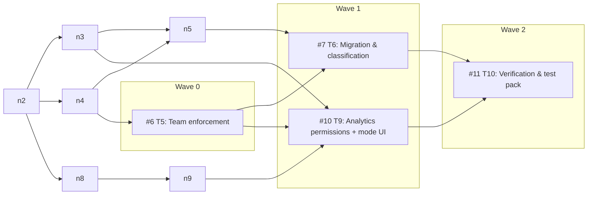

# Team Access + Analytics — Ticket Schedule

Live view of the T1–T10 ticket DAG. Everything between the marker comments is
regenerated by `.github/scripts/render_schedule.py` (workflow:
`.github/workflows/schedule-render.yml`) from native GitHub issue dependency
edges and issue state — edit the `tickets` list in the frontmatter, not the
generated section.

- Spec: [#1](https://github.com/bugscoderlab/open-notebook/issues/1)
- Only **open** tickets are scheduled into waves; closed tickets vanish
  automatically as their issues close.
- "Open external blockers" lists blockers outside this ticket set that still
  gate a wave.

```mermaid
gantt
  title team-access — one day per wave
  dateFormat X
  section Wave 0
  W0 :0, 86400
  section Wave 1
  W1 :86400, 172800
  section Wave 2
  W2 :172800, 259200
```

<!-- BEGIN GENERATED SCHEDULE -->

| Wave | Tickets | Open external blockers |
|---|---|---|
| 0 | #6 | — |
| 1 | #7, #10 | — |
| 2 | #11 | — |
<!-- END GENERATED SCHEDULE -->
